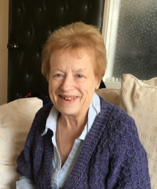

# Tributes from family and friends

Thank you Mum for raising me _kindly_ into the man I am today.
Through good, bad and ugly times, you loved and supported me. When I achieved, you proudly celebrated my success and when I erred, your council was without judgement. 
You gave all that I _needed_ and it was a privilege to help you in return.

You were a conscientious and faithful friend, a willing volunteer who gave your time generously and with enthusiasm. 

You greatly enjoyed singing and regularly added your _sweet_ voice to the _Long Eaton U3A Singers_ group.

**_by Richard Wheatley_**

### License
See the [License File](./LICENSE.md).